## Propuesta Arquitectura del Agente de migracion 

### 1. Read_Manifest_and_Check_API (Ingesta y Pre-Validación)

* **Inicio:** El flujo comienza cuando un humano invoca al agente con la ruta a un `manifest.yaml`.
* **Acción:** Este primer nodo (una herramienta de Python) lee el manifiesto para extraer:
    * La lista de pipelines a migrar (`pipelines_to_migrate`).
    * Las credenciales de API (`credentials`).
* **Lógica (Pre-flight check):** Confirma la conectividad haciendo "ping" a las APIs de GitHub ó Databricks.
* **Actualización de Estado:** El `GraphState` se actualiza con `credentials`, `api_connectivity_ok = True`, y la lista `pipelines_to_migrate`.

> **Nota sobre el Bucle:** Tras este paso, el grafo inicia un bucle. Procesará cada ítem de la lista `pipelines_to_migrate` uno por uno, ejecutando los siguientes pasos para cada pipeline.

---

### 2. Extractor_API_Client (Extracción de Datos Crudos)

* **Acción:** Este nodo toma las `credentials` del estado y los datos del pipeline actual en el bucle.
* **Lógica (Cliente de API):**
    1.  Llama a la **API de Databricks** para obtener notebooks y configuraciones.
    2.  Llama a la **API de GitHub** para obtener el JSON de ADF del repositorio.
* **Lógica (LLM):** Una vez que tiene los artefactos 3.0 crudos (`raw_artifacts_3_0`), usa el LLM (vía Asimov) para:
    * Normalizarlos al `normalized_schema_v4.json`.
    * Detectar el `environment_type` (slv o gld).
* **Actualización de Estado:** El `GraphState` se actualiza con `normalized_schema_v4` y `environment_type`.
(falta actualizar arquitectura de extractor)

---

### 3. Enrutador Condicional (La Bifurcación)

* **Acción:** Un "Edge Condicional" (enrutador lógico) lee el `environment_type` del estado.
* **Lógica:** Decide qué conjunto de *Translators* ejecutar en paralelo en el siguiente paso.
(Falta agregar actualizaciones post revision)

---

### 4. Translators (El "Fan-Out" Paralelo)

El grafo ejecuta múltiples nodos *Translator* simultáneamente ("fan-out").

* **Si es `slv` (Hopsflow):**
    * `TransformationsTranslator`
* **Si es `gld` (Brewtiful):**
    * `NotebookTranslator`
* **Comunes (ejecutados en ambos casos):**
    * `ACLTranslator`
    * `MetadataTranslator`
    * `QualityTranslator`
    * `SyncTranslator`
    * `PipelineTranslator`
    * `ObservabilityTranslator` 
* **Actualización de Estado:** A medida que cada traductor termina, "llena" su campo correspondiente en el `GraphState` (ej. `state['acl_yaml'] = "..."`).

Para -> `NotebookTranslator` se realiza un --> `Ruff Format (tool)` antes de pasar al validator

---

### 5. Validator_Tool (La Validación Específica)

* **Acción (Sincronización):** Este nodo actúa como una barrera. **Espera a que todos los traductores del Paso 4 terminen.**
* **Lógica (Herramienta):** Este nodo **no** es un LLM. Es una herramienta de Python que ejecuta el validador existente sobre los artefactos generados.
* **Comando Específico:** `(agregar comando)`
* **Actualización de Estado:** Captura la salida de texto (stdout/stderr) del comando y la guarda en `state['validator_output']`.

---

### 6. Check Validation (El Bucle de Auto-Corrección) 

* **Acción:** Un "Edge Condicional" (enrutador) lee el `state['validator_output']`.

* **Lógica (Caso A - Fallo):**
    1.  Si `validator_output` contiene errores, el enrutador establece `validation_passes = False` e incrementa `retry_count`.
    2.  El flujo se desvía al **CorrectorAgent** (un LLM).
    3.  El *CorrectorAgent* recibe los errores (`validator_output`) y los artefactos fallidos.
    4.  El agente corrige los artefactos en el estado y **el flujo regresa al Paso 5 (Validator_Tool)** para una nueva validación. (Maximo 3 iteraciones)

* **Lógica (Caso B - Éxito):**
    1.  Si `validator_output` no muestra errores, el enrutador establece `validation_passes = True`.
    2.  El flujo rompe el bucle de corrección y continúa.

---

### 7. Human_Approval_Node (Parada Obligatoria) (Solo para periodo de prueba)

* **Acción:** El flujo solo llega aquí después de una validación exitosa (`validation_passes == True`).
* **Lógica:** El grafo **PAUSA** su ejecución. Esto es un requisito de negocio explícito para la validación humana.
* **Interacción:** El sistema espera hasta que un humano revise los artefactos generados y envíe una decisión ("APPROVE" o "REJECT") que actualiza `state['human_approval_decision']`.

---

### 8. Check Human Decision (Aprobación Final)

* **Acción:** El grafo se reanuda cuando `human_approval_decision` se llena y lee la decisión.
* **Lógica (REJECT):** Si es "REJECT", el flujo se desvía a un nodo `END (Rejected)` y el proceso para *ese* pipeline termina.
* **Lógica (APPROVE):** Si es "APPROVE", el flujo continúa hacia el empaquetado final.

---

### 9. ReporterLogger y Generator (Reporte y Empaquetado) 📦

* **Acción (ReporterLogger):** Genera el `migration_summary.md`, documentando todo el proceso (incluyendo la validación y la aprobación humana).
* **Acción (Generator):** Recolecta todos los artefactos aprobados (.yaml, notebooks) y reportes (.md, .json) del estado.
* **Lógica:** Realiza un Push al repo correspondiente al caso
* **Actualización de Estado:** El `GraphState` se actualiza con la ruta en `migration_package_path`.

---

### 10. END (Package Ready)

* El flujo para este pipeline individual termina.
* El grafo principal **vuelve al Paso 1** y comienza a procesar el siguiente ítem de la lista `pipelines_to_migrate` del manifiesto, repitiendo todo el proceso.

### Diagrama 

```mermaid


flowchart TD
    subgraph "FlujoDeMigracion"

        %% --- 1. Inicio y Pre-Validacion ---
        A([START - manifest.yaml]):::flow --> B["1. Read_Manifest_and_Check_API - Lee manifiesto y credenciales. Valida conectividad API"]:::agent

        %% --- 2. Extraccion y Enrutamiento ---
        B --> C["2. Extractor_API_Client - Llama a APIs GitHub / Databricks para obtener assets 3.0"]:::agent
        C --> D{"3. Enrutador Condicional - Detecta slv, bronce o gld del asset"}:::tool

        %% --- 3. Ramas Paralelas (Fan-Out) ---

        %% Ramal SLV / BRONCE (Hopsflow)
        subgraph Paralelo_SLV
            direction LR
            P2[TransformationsTranslator]:::tool
        end
        D -- slv / bronce --> P2

        %% Ramal GLD (Brewtiful)
        D -- gld --> G1[NotebookTranslator]:::tool
        G1 --> RF["Ruff Format (TOOL)"]:::tool

        %% Ramal Comun (Siempre se ejecuta) - incluye P1
        subgraph Paralelo_Comun
            direction LR
            P1[PipelineTranslator]:::tool
            C1[ACLTranslator]:::tool
            C2[MetadataTranslator]:::tool
            C3[QualityTranslator]:::tool
            C4[SyncTranslator]:::tool
            C5[ObservabilityTranslator]:::tool
        end

        D -- all --> P1

        D -- gld --> C1 & C2 & C3 & C4 & C5
        D -- slv / bronce --> C1 & C2 & C3 & C4 & C5

        %% --- 4. Validacion y Bucle de Correccion ---
        P1 --> V["4. Validator_Tool - Ejecuta engineeringstore --validate-dags"]:::tool
        P2 --> V
        RF --> V
        C1 & C2 & C3 & C4 & C5 --> V

        V --> CV{"5. Check Validation - Reporte de engineeringstore OK?"}:::tool
        CV -- FAIL --> COR["6. CorrectorAgent - Usa output de engineeringstore para corregir artefactos (MAX 3 iter.)"]:::agent
        COR --> V

        %% --- 5. Aprobacion Humana (Obligatoria) ---
        CV -- PASS --> HITL["7. Human_Approval_Node - PAUSA: espera aprobación humana final (Solo para Periodo de prueba)"]:::human

        %% --- 6. Flujo Final (Reporte y Push) ---
        HITL --> CH{"8. Check Human Decision"}:::human
        CH -- APPROVE --> R["9. ReporterLogger - Escribe migration_summary.md"]:::tool
        R --> GEN["10. Generator - Realiza push al repositorio objetivo"]:::tool
        GEN --> Z([END - Package Ready]):::flow

        %% --- 7. Salida por Rechazo ---
        CH -- REJECT --> ZR([END - Rejected by Human]):::flow
    end

    %% --- Estilos de colores ---
    classDef agent fill:#9fd5ff,stroke:#004d80,stroke-width:1px,color:#000;
    classDef tool fill:#fff3b0,stroke:#806c00,stroke-width:1px,color:#000;
    classDef human fill:#c8f7c5,stroke:#2b8000,stroke-width:1px,color:#000;
    classDef flow fill:#e0e0e0,stroke:#888,stroke-width:1px,color:#000;

```

