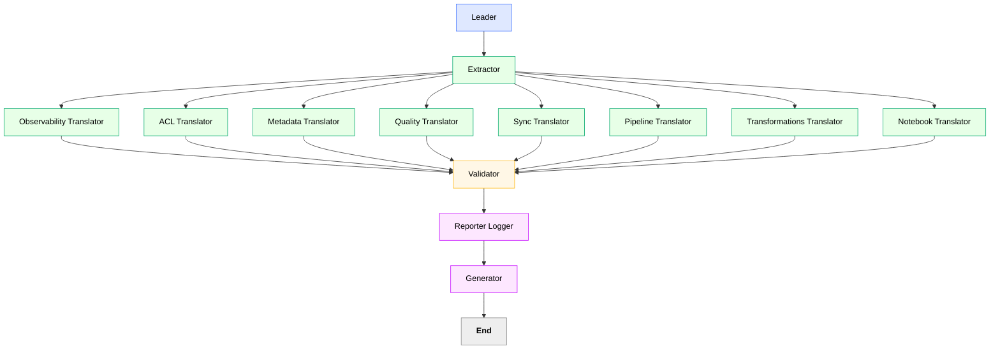

# 🧠 DataMigrationCrew – Arquitectura Revisada (v2)

## 🎯 Propósito

Automatizar la **migración inteligente de artefactos 3.0 → 4.0**, diferenciando frameworks (`Hopsflow` vs `Brewtiful`), generando múltiples YAMLs especializados y documentando el proceso en Markdown.
El objetivo es lograr **una migración trazable, auditable y completamente reproducible.**

---

## ⚙️ CrewAI Configuration (v2)

```yaml
crew:
  name: DataMigrationCrew
  description: >
    Orquesta la migración técnica desde la plataforma 3.0 hacia 4.0,
    generando múltiples YAMLs (acl, metadata, pipeline, observability, quality, sync,
    transformations, notebook) y documentación en Markdown.

  roles:
    - name: Leader
      goal: Coordinar el flujo general, detectar el tipo de entorno (Hopsflow o Brewtiful),
             y asignar tareas a los traductores correspondientes.
      agent_type: leader
      inputs: [pipeline_path, config_path]
      outputs: [migration_report]

    - name: Extractor
      goal: Extraer y normalizar artefactos ADF/Databricks, generando normalized_schema_v4.json.
      agent_type: worker
      inputs: [adf_pipeline_json, notebooks, configs]
      outputs: [normalized_schema_v4.json, environment_type]  # gld/slv

    - name: ACLTranslator
      goal: Generar acl.yaml con políticas de acceso y permisos.
      agent_type: worker
      inputs: [normalized_schema_v4.json]
      outputs: [acl.yaml]

    - name: MetadataTranslator
      goal: Crear metadata.yaml con taxonomía y atributos estándar.
      agent_type: worker
      inputs: [normalized_schema_v4.json]
      outputs: [metadata.yaml]

    - name: PipelineTranslator
      goal: Generar pipeline.yaml para flujos no-gold (Hopsflow).
      agent_type: worker
      condition: environment_type == "slv"
      inputs: [normalized_schema_v4.json]
      outputs: [pipeline.yaml]

    - name: TransformationsTranslator
      goal: Crear transformations.yaml con lógica de procesamiento para flujos no-gold.
      agent_type: worker
      condition: environment_type == "slv"
      inputs: [normalized_schema_v4.json]
      outputs: [transformations.yaml]

    - name: NotebookTranslator
      goal: Generar notebooks adaptados al framework Brewtiful (solo gold).
      agent_type: worker
      condition: environment_type == "gld"
      inputs: [normalized_schema_v4.json]
      outputs: [generated_notebooks]

    - name: QualityTranslator
      goal: Crear quality.yaml con reglas de validación y checks técnicos.
      agent_type: worker
      inputs: [normalized_schema_v4.json]
      outputs: [quality.yaml]

    - name: SyncTranslator
      goal: Generar sync.yaml con dependencias de orquestación y refresh policies.
      agent_type: worker
      inputs: [normalized_schema_v4.json]
      outputs: [sync.yaml]

    - name: ObservabilityTranslator
      goal: Crear observability.yaml; su input proviene de webhooks y user input, no del extractor.
      agent_type: worker
      inputs: [webhook_defaults, user_input]
      outputs: [observability.yaml]

    - name: Validator
      goal: Validar taxonomía, coherencia, naming y relaciones inter-yaml.
      agent_type: evaluator
      inputs:
        - acl.yaml
        - metadata.yaml
        - pipeline.yaml
        - quality.yaml
        - sync.yaml
        - transformations.yaml
        - generated_notebooks
        - observability.yaml
      outputs: [validation_report.json]

    - name: ReporterLogger
      goal: Generar un archivo Markdown resumen (migracion_summary.md) con lo realizado, decisiones y resultados.
      agent_type: builder
      inputs: [validation_report.json, migration_report]
      outputs: [migration_summary.md]

    - name: Generator
      goal: Empaquetar todos los artefactos en migration_package.zip.
      agent_type: builder
      inputs:
        - acl.yaml
        - metadata.yaml
        - pipeline.yaml
        - quality.yaml
        - sync.yaml
        - transformations.yaml
        - observability.yaml
        - migration_summary.md
        - validation_report.json
      outputs: [migration_package.zip]
```

---

## 🧩 Flujo General (LangGraph + CrewAI)



---

## 💡 Consideraciones técnicas

* El **Leader** detecta el *environment_type* (`gld` o `slv`) y decide si ejecuta el **NotebookTranslator** o **Pipeline + Transformations Translators**.
* El **ObservabilityTranslator** se ejecuta en paralelo, alimentado por **webhooks** y **inputs de usuario**, no por el extractor.
* El **ReporterLogger** escribe un resumen Markdown para auditoría, integrando los outputs del Validator y del Leader.
* Todos los outputs se empaquetan en el **Generator** para revisión y despliegue final.

# Next steps

### ACL TBD migración de grupos 
API databricks o lo que sea para ver accesos actuales y replicarlos.

### Transformations
preguntar para tablas que no son sap ver como se ven las operaciones de brz a silver

### Observability file sería webhook default users, user input

### Diferenciar cuando es hopsflow(brz slv) o brewtiful(gld)
con la diferenciacion, cuando sea gold, se invocaria el notebook translator, cuando no todo va al pipeline transalator

### Reporter logger = md writer de lo que se hizo como resumen.

