# Arquitectura de Migración Inteligente

## El Problema: Migración de Lógica de Plataforma

Este proyecto aborda la migración de pipelines de datos de nuestra **Plataforma 3.0** a la nueva **Plataforma 4.0**.

Los artefactos de la 3.0 consisten en una combinación de:
* **JSONs de Azure Data Factory (ADF):** Definen el flujo de orquestación.
* **Notebooks de Databricks:** Contienen la lógica de transformación en Python/Spark.

La Plataforma 4.0 desmantela esta estructura en favor de un conjunto de 8 o más archivos YAML especializados (como `acl.yaml`, `metadata.yaml`, `pipeline.yaml`, etc.), cuya estructura depende del framework de destino.

---

## El Desafío Central: Lógica Condicional (Hopsflow vs. Brewtiful)

La complejidad de la traducción radica en que la Plataforma 4.0 utiliza frameworks distintos basados en la capa de la Arquitectura Medallion:

* **Framework Hopsflow:** Se utiliza para pipelines de capa (brz, slv).
* **Framework Brewtiful:** Se utiliza para pipelines de capa Oro (gld).

Por lo tanto, el sistema de migración debe primero clasificar el pipeline 3.0 y luego generar un conjunto de artefactos completamente diferente basado en esa clasificación.

---

## La Solución: Una Arquitectura de Agente Robusta (LangGraph)

Para automatizar esta traducción compleja, se diseñó un agente basado en **LangGraph**. Esta arquitectura permite construir un flujo de trabajo por pasos, condicional, paralelizable y robusto.

---
#### Para comprender la estructura de la arquitectura, es fundamental definir los tres tipos de nodos que conforman esta solución.
## Tipos de Nodos en la Arquitectura

La estructura se compone de tres tipos principales de nodos:

### 1. Nodo-Herramienta (El Trabajador o Enrutador)
**¿Tiene LLM?** No.
**¿Tiene Tools?** No. El nodo *es* la herramienta (una sola función de Python).
**Propósito:** Ejecutar tareas deterministas (mecánicas) o lógicas (enrutamiento if/else). No "piensa", solo "hace".
* **Ejemplos en nuestra arquitectura:**
    * `Read_Manifest_and_Check_API`
    * `Framework_Loader`
    * `Enrutador_de_Translators`
    * `Validator_Tool`
    * `Check Validation`
    * `Check Human Decision`
    * `Generator`
    * `Ruff Format`

### 2. Nodo-Agente Simple (El Especialista)
**¿Tiene LLM?** Sí.
**¿Tiene Tools?** No.
**Propósito:** Ejecutar una tarea de "pensamiento" o traducción altamente especializada. Su inteligencia está 100% enfocada en su prompt específico. No decide entre herramientas, solo ejecuta su única tarea de IA.
* **Ejemplos en nuestra arquitectura:**
    * `Schema_Normalizer`
    * Todos los 8+ Translators (ej. `ACLTranslator`, `PipelineTranslator`, etc.)
    * `CorrectorAgent`
    * `ReporterLogger`

### 3. Nodo-Agente con Herramientas (El Gerente)
**¿Tiene LLM?** Sí.
**¿Tiene Tools?** Sí. Se le proporciona un "cinturón de herramientas" (múltiples funciones) que puede usar.
**Propósito:** Ejecutar tareas dinámicas o exploratorias. El LLM (el "Gerente") decide qué herramientas usar y en qué orden para cumplir un objetivo complejo.
* **Ejemplos en nuestra arquitectura:**
    * `Data_Fetcher` (que decide si usar la `github_api_tool` o la `databricks_api_tool`)

---

## El Flujo Completo de la Arquitectura

Este flujo describe el procesamiento de un solo pipeline de la lista contenida en el manifiesto.

```mermaid

flowchart TD
    subgraph MigrationFlow
        
        %% --- 1. Inicio y Pre-Validacion ---
        A["START - manifest.yaml"]:::flow --> B["1. Read_Manifest_and_Check_API Tool: Lee manifiesto y pings a APIs (GitHub/DataFactory)"]:::tool

        %% --- 2. crea Framework (Nuevo Orden) ---
        C["2. Framework_creator Tool: Parsea nombre (brz/gld) y crea plantillas Hopsflow/Brewtiful"]:::tool
        B --> C

        %% --- 3. Extractor (Simplificado a Tool) ---
        D["3. Extractor_Tool Tool: Lee repos de GitHub y DataFactory para obtener assets 3.0"]:::tool
        C --> D

        %% --- 4. Normalizador (LLM) ---
        E["4. Schema_Normalizer Agente Simple: 🧠 LLM\nTraduce assets 3.0 a schema_v4.json"]:::agent
        D --> E
        
        %% --- 5. Enrutador ---
        F{"5. Enrutador_de_Translators Tool: Lista los nodos\nparalelos segun brz/gld"}:::tool
        E --> F

        %% --- 6. Ramas Paralelas (Fan-Out) ---
        %% Ramal SLV / BRONCE (Hopsflow)
        P2["TransformationsTranslator"]:::agent
        F -->|"slv / brz"| P2

        %% Ramal GLD (Brewtiful)
        G1["NotebookTranslator"]:::agent
        RF["Ruff Format (TOOL)"]:::tool
        F -->|"gld"| G1
        G1 --> RF

        %% Ramal Comun (Siempre se ejecuta)
        P1["PipelineTranslator (Hopsflow/brewtiful)"]:::agent
        C1["ACLTranslator"]:::agent
        C2["MetadataTranslator"]:::agent
        C3["QualityTranslator"]:::agent
        C4["SyncTranslator"]:::agent
        C5["ObservabilityTranslator"]:::agent

        %% --- Corrección de lógica: P1 (Pipeline) NO es común, es slv/brz
        F -->|"slv / brz / gld"| P1
        F -->|"slv / brz / gld"| C1
        F -->|"slv / brz / gld"| C2
        F -->|"slv / brz / gld"| C3
        F -->|"slv / brz / gld"| C4
        F -->|"slv / brz / gld"| C5

        %% --- 7. Validacion y Bucle de Correccion ---
        V["7. Validator_Tool\nTool: Ejecuta 'engineeringstore --validate-dags'"]:::tool
        P1 --> V
        C1 --> V
        C2 --> V
        C3 --> V
        C4 --> V
        C5 --> V
        P2 --> V
        RF --> V

        CV{"8. Check Validation\nTool: Reporte de 'engineeringstore' OK?"}:::tool
        V --> CV
        
        COR["9. CorrectorAgent\nAgente Simple: 🧠 LLM\nUsa output para corregir (MAX 3 iter.)"]:::agent
        CV -->|"FAIL"| COR
        COR --> V

        %% --- 8. Aprobacion Humana (Obligatoria) ---
        HITL["10. Human_Approval_Node\nPAUSA: espera aprobación humana final"]:::human
        CV -->|"PASS"| HITL

        %% --- 9. Flujo Final (Reporte y Push) ---
        CH{"11. Check Human Decision"}:::human
        HITL --> CH
        
        R["12. ReporterLogger\nAgente Simple: 🧠 LLM\nEscribe migration_summary.md"]:::agent
        CH -->|"APPROVE"| R
        
        GEN["13. Generator\nTool: Realiza push al\nrepositorio objetivo"]:::tool
        R --> GEN
        
        Z(["END - Package Ready"]):::flow
        GEN --> Z

        %% --- 10. Salida por Rechazo ---
        ZR(["END - Rejected by Human"]):::flow
        CH -->|"REJECT"| ZR
    end

    %% --- STYLES ---
    classDef tool fill:#fff3b0,stroke:#806c00,stroke-width:1px,color:#000;
    classDef agent fill:#9fd5ff,stroke:#004d80,stroke-width:1px,color:#000;
    classDef agent_with_tools fill:#ffd8b1,stroke:#a15800,stroke-width:1px,color:#000;
    classDef human fill:#c8f7c5,stroke:#2b8000,stroke-width:1px,color:#000;
    classDef flow fill:#e0e0e0,stroke:#888,stroke-width:1px,color:#000;

```



### Paso 1: Read_Manifest_and_Check_API
* **Tipo de Nodo:** Nodo-Herramienta (Puro Python) | **`:::tool`**
* **Inicio:** El flujo comienza cuando un humano invoca al agente con la ruta a un `manifest.yaml`.
* **Acción:** Este nodo (una función de Python) lee el `manifest.yaml` para extraer:
    * La lista de *pipelines* a migrar (`pipelines_to_migrate`).
    * Las credenciales de API (`credentials`).
* **Lógica:** Realiza un "pre-flight check" usando las credenciales para hacer "ping" a las APIs de GitHub y DataFactory y confirmar la conectividad.
* **Actualización de Estado:** El `GraphState` se actualiza con `credentials`, `api_connectivity_ok = True`, y la lista `pipelines_to_migrate`. El orquestador externo ahora iterará sobre esta lista.

### Paso 2: Framework_creator
* **Tipo de Nodo:** Nodo-Herramienta (Puro Python) | **`:::tool`**
* **Acción:** Este nodo toma el `current_pipeline_data` (del manifiesto) del estado.
* **Lógica:** Es un `if/else` que **detecta** el `environment_type` (`brz`/`slv`/`gld`) parseando el nombre de la tabla (ej. `...brz_maz_...`).
* **Lógica (Comandos):** Basado en el tipo detectado, **crea** los *template files* de Hopsflow o Brewtiful ejecutando los comandos de `engineeringstore`:
    ```bash
    engineeringstore transformation --create-template-files # (glds)
    engineeringstore ingestion --create-template-files # (brz, slv)
    ```
* **Actualización de Estado:** Guarda las plantillas de texto crudo (ej. `state['pipeline_template']`) y el `environment_type` detectado en el estado.

### Paso 3: Extractor_Tool
* **Tipo de Nodo:** Nodo-Herramienta (Puro Python) | **`:::tool`**
* **Acción:** Este nodo se activa después del `Framework_creator`. Toma las `credentials` y el `current_pipeline_data` del estado.
* **Lógica:** Es una función de Python determinista. **No usa un LLM**.
    * Llama a la API de GitHub para obtener el JSON de ADF.
    * Llama a la API de DataFactory (o GitHub) para obtener el *notebook*.
* **Actualización de Estado:** Guarda los artefactos 3.0 crudos en `state['raw_artifacts_3_0']`.

### Paso 4: Schema_Normalizer
* **Tipo de Nodo:** Nodo-Agente Simple (Especialista) | **`:::agent`**
* **Acción:** Este es el **primer nodo de LLM** en el flujo. Toma los `raw_artifacts_3_0` (del Paso 3) del estado.
* **Lógica (LLM):** Llama al LLM (Especialista) con un *prompt* enfocado en una sola tarea:
    1.  **Traducir:** Analizar los artefactos 3.0 crudos y generar el `normalized_schema_v4.json`. (El `environment_type` ya fue detectado en el Paso 2).
* **Actualización de Estado:** Guarda el `normalized_schema_v4` en el estado.

### Paso 5: Enrutador_de_Translators
* **Tipo de Nodo:** Nodo-Herramienta (Enrutador Condicional) | **`:::tool`**
* **Acción:** Lee el `environment_type` (detectado en el Paso 2) del estado.
* **Lógica:** Es un `if/else` que define el plan de ejecución paralelo. Define una lista de traductores comunes (ej. `ACLTranslator`, `MetadataTranslator`, etc.) y añade los traductores condicionales (`TransformationsTranslator` si es 'slv'/'brz', `NotebookTranslator` si es 'gld'). Para el `PipelineTraslator` identifica si es para Hopsflow (brz,slv) ó Brewtiful (gld)
* **Salida:** Retorna una lista de *strings* (ej. `["ACLTranslator", "NotebookTranslator"...]`) que LangGraph usará para el siguiente paso.


### Paso 6: Translators (El "Fan-Out" Paralelo)
* **Tipo de Nodo:** Nodos-Agente Simples (Especialistas) | **:::agent**
* **Acción:** LangGraph toma la lista del enrutador y ejecuta todos esos nodos `Translator` en **paralelo**.
* **Lógica (LLM):** Cada nodo `Translator` (ej. `ACLTranslator`, `MetadataTranslator`, etc.) es un "Especialista" que toma el `normalized_schema_v4` y su plantilla correspondiente (cargada en el Paso 4) y genera el archivo YAML final.
* **Actualización de Estado:** Cada nodo escribe en su propio campo del estado (ej. `state['acl_yaml'] = "..."`).

### Paso 7: Ruff Format
* **Tipo de Nodo:** Nodo-Herramienta (Puro Python) | **:::tool**
* **Acción:** Este nodo se ejecuta solo en el branch 'gld', después del `NotebookTranslator`.
* **Lógica:** Es una función simple que toma el código del `generated_notebooks` y lo formatea usando la herramienta `ruff` para asegurar la calidad del código.
* **Actualización de Estado:** Sobrescribe `state['generated_notebooks']` con el código formateado.

### Paso 8: Validator_Tool (Validación Específica)
* **Tipo de Nodo:** Nodo-Herramienta (Trabajador) | **:::tool**
* **Acción (Sincronización):** Actúa como una barrera **"Fan-In"**. Espera a que todos los traductores (Paso 6) y el formateador (Paso 7, si se ejecutó) terminen.
* **Lógica (Herramienta):** Ejecuta el comando `engineeringstore --validate-dags` sobre los artefactos generados.
* **Actualización de Estado:** Captura la salida de texto (stdout/stderr) y la guarda en `state['validator_output']`.

### Paso 9: Check Validation (Bucle de Auto-Corrección)
* **Tipo de Nodo:** Nodo-Herramienta (Enrutador Condicional) | **:::tool**
* **Acción:** Lee el `state['validator_output']` y el `state['retry_count']`.
* **Lógica (Fallo):** Si el `validator_output` contiene errores y `retry_count` es menor a 3:
    * Incrementa `retry_count` y establece `validation_passes = False`.
    * Desvía el flujo al `CorrectorAgent`.
* **Lógica (Éxito):** Si no hay errores:
    * Establece `validation_passes = True`.
    * Desvía el flujo al `Human_Approval_Node`.

### Paso 10: CorrectorAgent (El Corrector)
* **Tipo de Nodo:** Nodo-Agente Simple (Especialista) | **:::agent**
* **Acción:** Se activa en el bucle "FAIL".
* **Lógica (LLM):** Recibe un prompt muy específico que contiene el error (`validator_output`) y los artefactos fallidos del estado. Genera un nuevo conjunto de artefactos corregidos.
* **Actualización de Estado:** Sobrescribe los artefactos en el estado y el flujo vuelve al **Paso 8 (Validator_Tool)** para una nueva validación.

### Paso 11: Human_Approval_Node (Parada Obligatoria) (Solo en fase de prueba)
* **Tipo de Nodo:** Nodo de Pausa (Humano) | **:::human**
* **Acción:** Se activa solo después de una validación exitosa ("PASS").
* **Lógica:** **PAUSA** la ejecución del grafo, cumpliendo el requisito de que "un humano tiene que validar el resultado final". (Esto puede ser solo para el período de prueba).
* **Interacción:** El sistema espera a que un humano actualice `state['human_approval_decision']` con "APPROVE" o "REJECT".

### Paso 12: Check Human Decision (Aprobación Final)
* **Tipo de Nodo:** Nodo-Herramienta (Enrutador Condicional) | **:::human**
* **Acción:** Se reanuda cuando `human_approval_decision` se llena.
* **Lógica:** Lee la decisión.
    * Si es "APPROVE", retorna la ruta "APPROVE".
    * Si es "REJECT", retorna la ruta "REJECT".

### Paso 13: ReporterLogger (El Auditor)
* **Tipo de Nodo:** Nodo-Agente Simple (Especialista) | **:::agent**
* **Acción:** Se activa solo en el flujo "APPROVE".
* **Lógica (LLM):** Genera el `migration_summary.md` documentando todo el proceso, la validación exitosa y la aprobación humana.
* **Actualización de Estado:** Guarda el .md en `state['migration_summary_md']`.

### Paso 14: Generator (El Desplegador)
* **Tipo de Nodo:** Nodo-Herramienta (Trabajador) | **:::tool**
* **Acción:** Se activa después del `ReporterLogger`.
* **Lógica:** Recolecta todos los artefactos aprobados (.yaml, notebooks) y el reporte (.md) del estado. Usando las `credentials` del estado, realiza un `git push` para subir estos archivos al repositorio 4.0 objetivo.
* **Salida:** El flujo termina en `END (Package Ready)`.

### Paso 15: Bucle del Manifiesto
* **Acción:** Una vez que el flujo termina (ya sea en `END (Package Ready)` o `END (Rejected by Human)`), el orquestador externo vuelve al **Paso 2** para procesar el siguiente ítem en la lista `pipelines_to_migrate` del manifiesto, repitiendo todo el proceso.

---

## Propuesta de State (GraphState)

El `GraphState` es el único objeto de datos y la fuente central de verdad para nuestro flujo de migración.

Es un diccionario de Python que contiene toda la información de un pipeline mientras se procesa: entradas, credenciales, artefactos intermedios (como el schema), todos los YAMLs generados, los reportes de validación y las decisiones humanas.

En este proyecto, el `GraphState` nos permite:

* **Comunicación:** Es la forma en que los nodos se pasan información (ej. el Extractor le pasa el schema a los Translators).
* **Control de Flujo:** Permite a los enrutadores tomar decisiones lógicas al leer su contenido (ej. "si `environment_type` es 'gld', ir a `NotebookTranslator`").
* **Paralelismo:** Habilita que los 8 Translators se ejecuten al mismo tiempo, ya que cada uno escribe en su propio campo aislado dentro del estado.
* **Robustez (Bucles):** Es lo que hace posible el bucle de auto-corrección, al persistir el `validator_output` y el `retry_count` para que el `CorrectorAgent` sepa qué arreglar.
* **Interacción Humana:** Permite que el grafo se pause (esperando que se llene `human_approval_decision`) y se reanude más tarde, habilitando la validación humana.

```python


from typing import TypedDict, List, Dict, Any, Optional

class MigrationGraphState(TypedDict):
    """
    Este es el 'Estado' central (v6) que fluye a través del grafo de migración.
    Refleja la arquitectura v6 con la detección temprana del framework.
    """

    # --- SECCIÓN 1: ENTRADAS INICIALES Y MANIFIESTO ---
    # Llenado por el 'Read_Manifest_and_Check_API' (Paso 1)
    
    manifest_path: str                 # La ruta al 'manifest.yaml' que define el lote
    credentials: Optional[Dict[str, str]]    # Credenciales de API (GitHub, DataFactory) -> o en un env.
    api_connectivity_ok: bool                # Resultado del 'pre-flight check'
    pipelines_to_migrate: List[Dict[str, Any]] # La lista de trabajo del manifiesto
    
    # El pipeline individual que se está procesando actualmente en el bucle
    current_pipeline_data: Optional[Dict[str, Any]] 

    
    # --- SECCIÓN 2: FRAMEWORK Y PLANTILLAS ---
    # Llenado por el 'Framework_creator' (Paso 2)
    
    environment_type: Optional[str]        # 'slv', 'brz' o 'gld' (detectado al parsear el manifiesto)
    pipeline_template: Optional[str]         # El texto de la plantilla Hopsflow/Brewtiful
    transform_template: Optional[str]        # El texto de la plantilla Hopsflow
    notebook_template: Optional[str]         # El texto de la plantilla Brewtiful

    
    # --- SECCIÓN 3: EXTRACCIÓN 3.0 ---
    # Llenado por el 'Extractor_Tool' (Paso 3)
    
    raw_artifacts_3_0: Optional[Dict[str, Any]] # {"adf_json": "...", "notebook_code": "..."}

    
    # --- SECCIÓN 4: SCHEMA NORMALIZADO 4.0 ---
    # Llenado por el 'Schema_Normalizer' (Paso 4)
    
    normalized_schema_v4: Optional[Dict[str, Any]] # El JSON limpio, fuente de verdad

    
    # --- SECCIÓN 5: ARTEFACTOS DE TRADUCCIÓN (SALIDAS) ---
    # Llenados en paralelo por los nodos 'Translator' (Paso 6)

    # Comunes (gld, slv, brz)
    acl_yaml: Optional[str]              #
    metadata_yaml: Optional[str]         #
    quality_yaml: Optional[str]          #
    sync_yaml: Optional[str]             #
    observability_yaml: Optional[str]    #

    # Condicional 'slv'/'brz' (Hopsflow)
    pipeline_yaml: Optional[str]         #
    transformations_yaml: Optional[str]  #

    # Condicional 'gld' (Brewtiful - salida de NotebookTranslator + Ruff)
    generated_notebooks: Optional[List[str]] #

    
    # --- SECCIÓN 6: VALIDACIÓN Y BUCLE DE CORRECCIÓN ---
    # Llenado por 'Validator_Tool', 'Check Validation' y 'CorrectorAgent'
    
    validator_output: Optional[str]      # El stdout/stderr crudo de 'engineeringstore --validate-dags'
    validation_passes: bool              # True/False, basado en el análisis del 'validator_output'
    retry_count: int                     # Contador para el bucle de corrección (inicia en 0)


    # --- SECCIÓN 7: APROBACIÓN HUMANA ---
    # Llenado por el 'Human_Approval_Node'
    
    human_approval_decision: Optional[str] # La decisión del humano ('APPROVE' o 'REJECT')


    # --- SECCIÓN 8: SALIDAS FINALES Y AUDITORÍA ---
    # Llenado por 'ReporterLogger' y 'Generator'
    
    migration_summary_md: Optional[str]  # El resumen de auditoría .md
    
    # El resultado del push final al repositorio 4.0
    push_status: Optional[str]           # (ej. "Éxito: commit 7a8b9c1" o "Fallo: ...")

```

